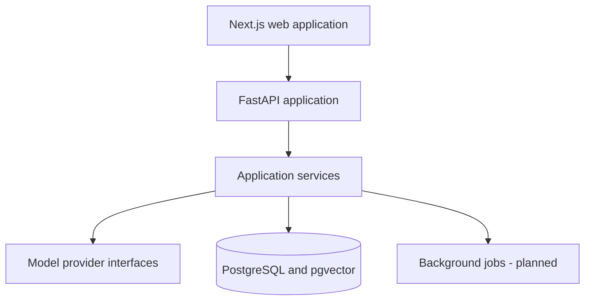

# Architecture

FlowRAGA begins as a modular monolith. This keeps local development and early deployment simple while preserving boundaries that can later move into workers or separate services.

## Engineering rules

1. Route handlers validate transport data and delegate business logic.
2. Domain services do not depend on FastAPI or browser concerns.
3. Model calls pass through explicit provider interfaces.
4. Credentials are read only from server-side environment variables.
5. User-owned records will always carry an owner identifier before public ingestion endpoints are introduced.
6. Long-running ingestion and evaluation will execute outside API request workers.
7. Open-weight local models are the default; hosted providers are optional adapters.

## Planned model defaults

- Embeddings: `BAAI/bge-small-en-v1.5`
- Multilingual embeddings: `BAAI/bge-m3`
- Reranking: `BAAI/bge-reranker-base`
- Generation: provider adapter supporting local Ollama-compatible open-weight models

Model packages are intentionally not installed in the foundation image. They will be introduced with resource limits, caching, health checks, and benchmarks during the RAG core phase.

