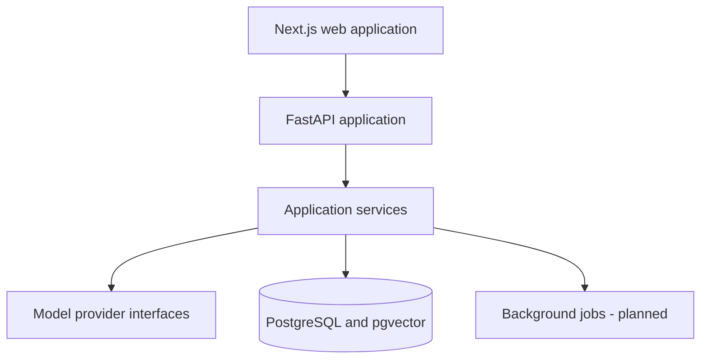
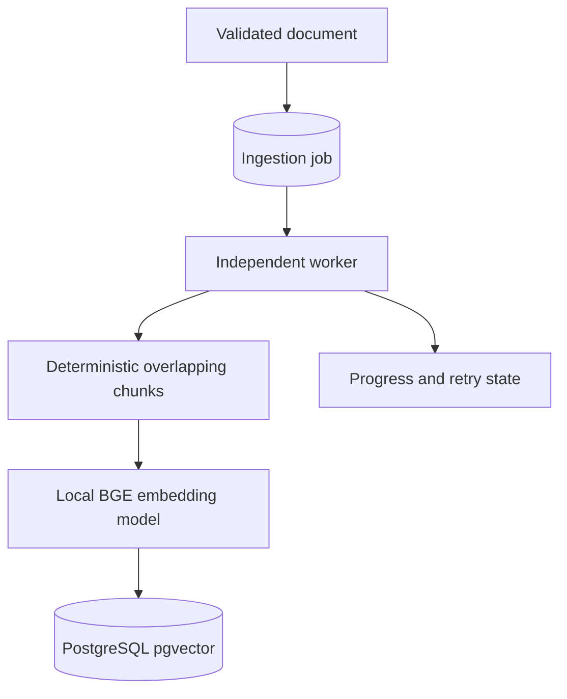
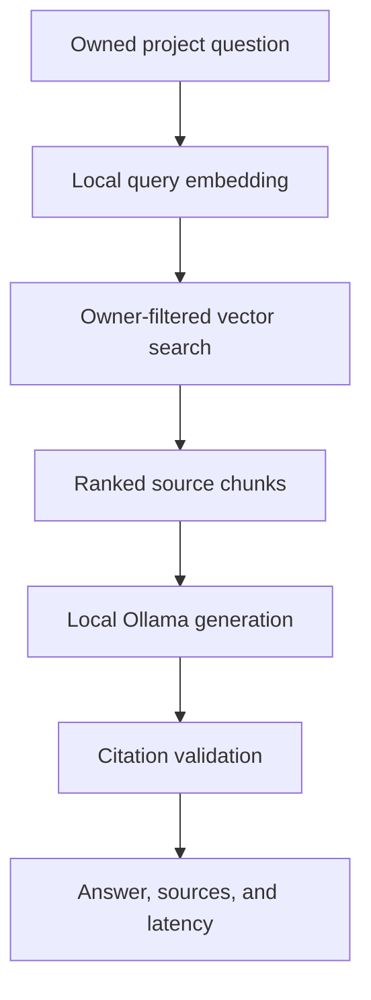

# Architecture

FlowRAGA begins as a modular monolith. This keeps local development and early deployment simple while preserving boundaries that can later move into workers or separate services.

## Engineering rules

1. Route handlers validate transport data and delegate business logic.
2. Domain services do not depend on FastAPI or browser concerns.
3. Model calls pass through explicit provider interfaces.
4. Credentials are read only from server-side environment variables.
5. User-owned records will always carry an owner identifier before public ingestion endpoints are introduced.
6. Long-running ingestion and evaluation will execute outside API request workers.
7. Open-weight local models are the default; hosted providers are optional adapters.

## Identity and session security

- Passwords are hashed with Argon2.
- Access tokens are short-lived JWTs with issuer, audience, type, expiry, and unique ID claims.
- Refresh tokens are opaque random values; only SHA-256 digests are stored.
- Refresh tokens rotate on every use and can be revoked independently.
- Projects include a non-null owner identifier and queries must filter by that owner.
- Browser refresh tokens are transmitted only through HttpOnly cookies.
- Access tokens and CSRF tokens are held in application memory, not local storage.
- Cookie-backed refresh and logout operations require a matching CSRF cookie and header.
- The browser obtains a short-lived CSRF token before attempting session restoration.

## Document ingestion security

- Documents are isolated by both project and owner identifiers.
- Uploads stream to generated storage keys and never use user-provided filenames as paths.
- PDF and DOCX signatures are verified; text inputs must be UTF-8 and non-binary.
- DOCX archives are checked for traversal, encryption, excessive entries, expansion, and compression ratios before parsing.
- File size, PDF page count, and archive expansion limits are configurable.
- Local storage is the initial adapter; object storage and asynchronous extraction can replace it without changing the API contract.

## Asynchronous indexing

- API workers validate and extract uploads, then enqueue indexing without loading an ML model.
- The worker claims jobs with row locking, embeds in bounded batches, and records progress.
- Failed jobs use bounded exponential retries and can be retried manually after exhaustion.
- A project-level SHA-256 uniqueness constraint prevents duplicate source indexing.
- Production vectors use `vector(384)` with an HNSW cosine index. Tests use a JSON-compatible variant.
- `BAAI/bge-small-en-v1.5` runs locally through FastEmbed; no paid model API is required.

## Grounded question answering

- Retrieval filters by both project and authenticated owner inside the database query.
- Top-k and cosine similarity thresholds are bounded and configurable.
- Retrieved chunks are serialized as untrusted data and never treated as model instructions.
- Answers must cite valid returned source labels. Citation-free or invalid output is rejected.
- If Ollama is unavailable, the API still returns retrieved evidence and an explicit status.
- `qwen2.5:3b` is the default local generator; no hosted LLM key is required.

## Conversation and retrieval quality

- Conversations, messages, evidence snapshots, and retrieval traces are owner-isolated records.
- Hybrid retrieval combines dense similarity and PostgreSQL full-text search using reciprocal-rank fusion.
- `Xenova/ms-marco-MiniLM-L-6-v2` provides an Apache-2.0 local cross-encoder reranking stage.
- Reranking is optional and degrades to fused ordering if the model is unavailable.
- Users can configure retrieval mode, top-k, threshold, and reranking for each question.
- Answer feedback is unique per message and can be updated without duplicating records.
- Conversation export produces Markdown containing the dialogue and cited source summary.

## Evaluation and observability

- Evaluation datasets contain labeled questions, optional reference answers, and relevant document IDs.
- Dedicated workers execute queued runs without tying up API request workers.
- Retrieval recall/precision, token F1, citation validity, and citation coverage are deterministic and reproducible.
- Every result stores its answer, evidence snapshot, stage latency, and configuration for comparison.
- JSON structured logs include request IDs, route templates, status, and duration without logging credentials or document content.
- Prometheus counters and latency histograms use bounded route-template labels to avoid high-cardinality IDs.
- Project evaluation APIs and reports are owner-scoped; metrics expose aggregate infrastructure data only.

## Planned model defaults

- Embeddings: `BAAI/bge-small-en-v1.5`
- Multilingual embeddings: `BAAI/bge-m3`
- Reranking: `BAAI/bge-reranker-base`
- Generation: provider adapter supporting local Ollama-compatible open-weight models

Model packages are intentionally not installed in the foundation image. They will be introduced with resource limits, caching, health checks, and benchmarks during the RAG core phase.
